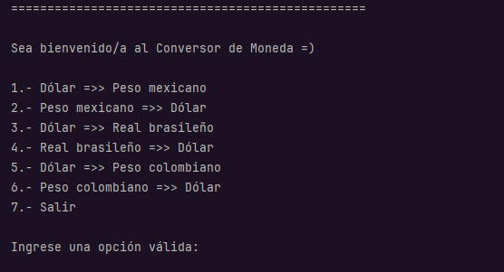
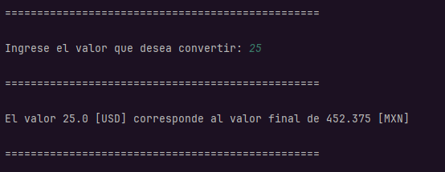
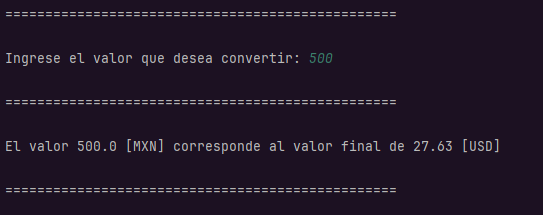
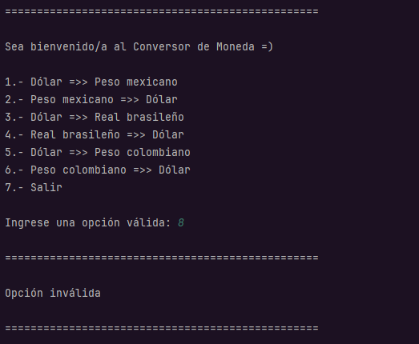
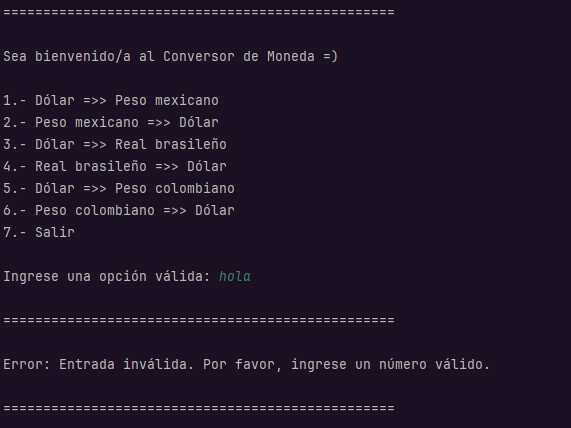
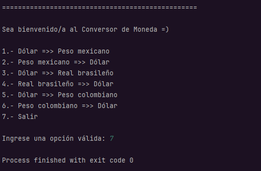

# Conversor de Monedas 🪙

Este proyecto es un conversor de monedas que utiliza la API de [ExchangeRate API](https://www.exchangerate-api.com/) para obtener las tasas de cambio. Fue desarrollado como parte de una formación Backend y se encuentra alojado en el siguiente repositorio de GitHub: [Conversor de Monedas](https://github.com/jb-rgb/Conversor-de-monedas-ONE).

## Descripción

El conversor permite realizar conversiones entre las siguientes monedas:

- Dólares (USD) a Pesos Mexicanos (MXN)
- Pesos Mexicanos (MXN) a Dólares (USD)
- Dólares (USD) a Real Brasileño (BRL)
- Real Brasileño (BRL) a Dólares (USD)
- Dólares (USD) a Peso Colombiano (COP)
- Peso Colombiano (COP) a Dólares (USD)

## Instalación

1. Clona el repositorio:
    ```bash
    git clone https://github.com/jb-rgb/Conversor-de-monedas-ONE.git
    ```

2. Navega al directorio del proyecto:
    ```bash
    cd Conversor-de-monedas-ONE
    ```

3. Descarga la dependencia GSON desde [Maven Repository](https://mvnrepository.com/artifact/com.google.code.gson/gson). Asegúrate de descargar la versión 2.10.1 o posterior.

4. Agrega la dependencia GSON en IntelliJ IDEA:
    - Abre IntelliJ IDEA y selecciona `File` > `Project Structure`.
    - Ve a la pestaña `Modules` y selecciona el módulo del proyecto.
    - Selecciona la pestaña `Dependencies`.
    - Haz clic en el botón `+`, selecciona `JARs or directories`.
    - Navega hasta la ubicación donde descargaste el archivo `gson-2.10.1.jar` y selecciónalo.
    - Haz clic en `Apply` y luego en `OK` para guardar los cambios.

5. Para usar la API con tu propia clave, ve a la clase `Consulta` y cambia la siguiente línea de código:
    ```java
    URI direccion = URI.create("https://v6.exchangerate-api.com/v6/tu_clave_de_api/latest/" + moneda);
    ```
   Donde `tu_clave_de_api` es la clave de API que obtienes de la página [ExchangeRate API](https://www.exchangerate-api.com/) al hacer tu registro.

6. Abre el proyecto en IntelliJ IDEA y asegúrate de que las dependencias han sido correctamente añadidas.

7. Ejecuta la aplicación:
    - En IntelliJ IDEA, haz clic en `Run` para iniciar la aplicación.

## Uso

Para utilizar el conversor, ingresa la cantidad y selecciona las monedas de origen y destino en la interfaz del usuario. El sistema mostrará el resultado de la conversión basada en la tasa de cambio actual proporcionada por la API.

## Funcionalidades Futuras

El proyecto tiene previstas las siguientes mejoras:

- **Registros con Marca de Tiempo:** Guardar un historial de conversiones con la fecha y hora de cada transacción.
- **Soporte para Más Monedas:** Ampliar el soporte a más monedas internacionales.
- **Historial de Conversiones:** Mostrar un historial detallado de todas las conversiones realizadas por el usuario.

## Autor

Este proyecto fue realizado por [Jorge Barahona](https://github.com/jb-rgb).

## Capturas de pantalla

### Menú Principal


### Conversión de Dólar a Peso Mexicano


### Coversión de Peso Mexicano a Dólar


### Opción Inválida


### Se introdujo un valor no númerico


### Terminar programa
